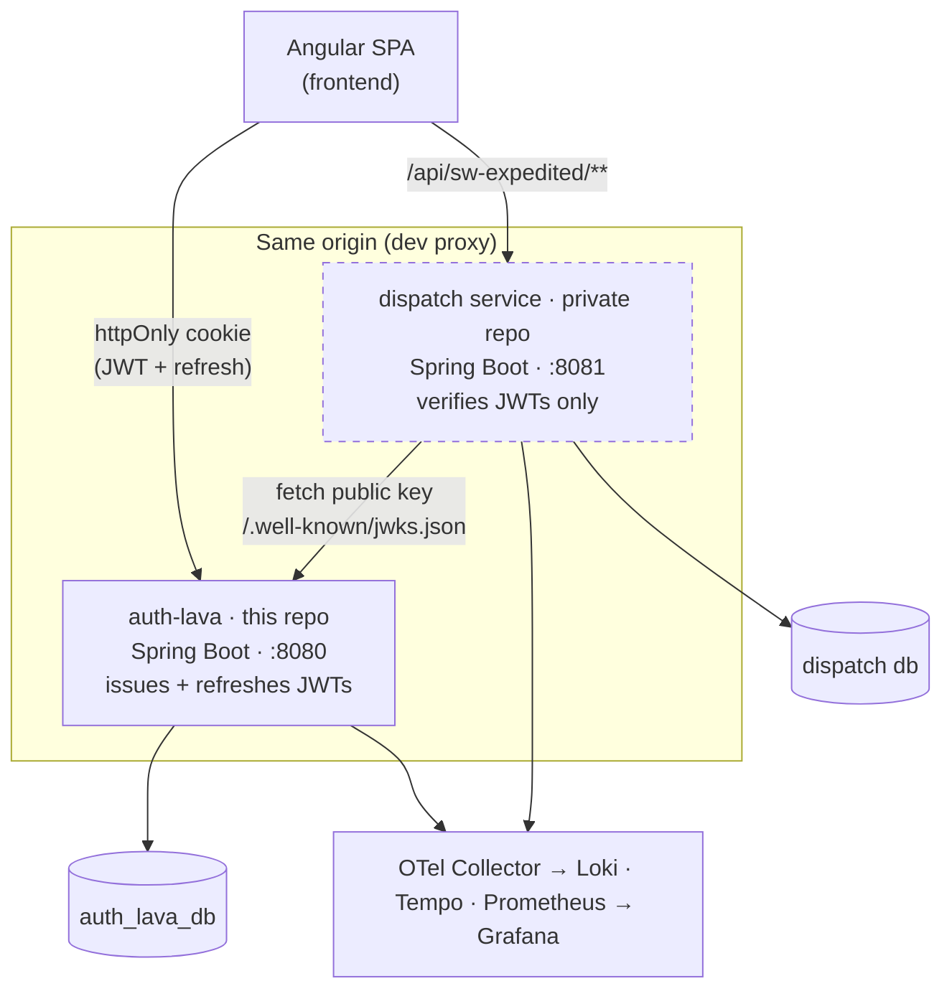

# auth-lava

A **from-scratch authentication service** and the Angular SPA built on it, designed so that other services can sit behind it without duplicating any login or session logic. auth-lava issues cookie-based, RS256-signed JWTs and publishes a JWKS endpoint; services behind it verify those tokens directly as OAuth2 resource servers.

One such service — a logistics-dispatch application integrating several real-world freight, TMS, and telematics systems — lives in a **separate private repository**. Its UI is part of the frontend here, and the architecture notes below describe how it authenticates, since that integration is the point of the design.

> Personal project. The stack, integrations, and infrastructure are production-shaped, but this is a single-author codebase built to explore a realistic auth + microservice architecture end to end.

---

## Architecture



Only **auth-lava** mints or refreshes tokens. Every other service — the dispatch service today, anything added the same way tomorrow — is a pure OAuth2 resource server that fetches auth-lava's public key from its JWKS endpoint and reads the bearer token from the same `ACCESS_TOKEN` cookie auth-lava sets, rather than an `Authorization` header. The frontend never touches a raw token.

---

## The components

### `backend/` — auth-lava
A standalone authentication service.

- **Email + password** registration with a verify-code flow, plus **OAuth2** social login (Google, GitHub) handled entirely server-side.
- **JWT access tokens + opaque refresh tokens**, delivered as **httpOnly cookies** — the SPA can't read them, closing off token-theft-via-XSS.
- **RS256 signing** with a published **JWKS** (`/.well-known/jwks.json`) so downstream services verify signatures without a shared secret.
- **TOTP MFA** (enroll / verify / disable) with backup codes.
- **Rate limiting** on login and MFA-verify, and **email-change** flows.
- Spring Boot 4.1 · Java 25 · Postgres via Liquibase + jOOQ.

### `frontend/` — Angular SPA
Consumes auth-lava and the dispatch service over the same cookie-based origin.

- **Angular 22** (standalone components, native control flow, zoneless-style signals throughout).
- **Signal-based state** with `@ngrx/signals` SignalStores; **Signal Forms** for validated input.
- **spartan/ui** (Brain headless primitives + Helm styled layer) on **Tailwind CSS v4**.
- Auth handled by an `AuthStore` single source of truth, route guards, and HTTP interceptors that transparently **refresh-and-retry on 401**.
- **Playwright** e2e suite that runs against a full in-memory fake of the auth API — no backend required.

---

## Cross-cutting

- **Observability** — services export logs, traces, and metrics over **OTLP** to an OpenTelemetry Collector, which fans out to **Loki / Tempo / Prometheus**, all queryable in **Grafana** with bidirectional trace↔log correlation. No custom appender — it's all configuration.
- **CI** — path-filtered GitHub Actions so a frontend change doesn't trigger backend builds (and vice versa); lint + build + test + e2e on every PR.
- **Git hygiene** — a Husky pre-commit hook dispatches by staged path (Maven Spotless for JVM code, Prettier + ESLint for the frontend). `main` is protected: no force-push or deletion, changes land via PR.

---

## Tech stack

| Layer | Stack |
|-------|-------|
| Auth service | Spring Boot 4.1, Java 25, Spring Security (OAuth2 + resource server), Liquibase, jOOQ, Postgres |
| Frontend | Angular 22, TypeScript 6, @ngrx/signals, Signal Forms, spartan/ui, Tailwind CSS v4, Vitest, Playwright |
| Infra (dev) | Docker Compose: Postgres, Mailpit, OpenTelemetry Collector, Loki, Tempo, Prometheus, Grafana |

---

## Running it locally

**Prerequisites:** Docker, Java 25, Node + [pnpm](https://pnpm.io/).

```bash
# 1. Shared dev infra — Postgres, Mailpit, and the full OTel → Grafana pipeline
docker-compose up -d           # from the repo root

# 2. Auth service (needs a .env — see backend/CLAUDE.md)
cd backend && ./mvnw spring-boot:run          # → localhost:8080

# 3. Frontend
cd frontend && pnpm install && pnpm start     # → localhost:4200
```

The core auth experience — registration, login, OAuth, MFA — runs with just those three steps. The dispatch screens additionally need the dispatch service (separate private repo) running on `localhost:8081`; without it those routes simply have no data behind them.

Grafana is at **localhost:3000** (anonymous admin, dev-only) and Mailpit — which captures all outbound verification/MFA email — at **localhost:8025**.

### Common commands

```bash
# Backend
cd backend && ./mvnw verify    # build + test

# Frontend
pnpm build                     # production build
pnpm test                      # unit tests (Vitest)
pnpm e2e                       # Playwright e2e (backend fully mocked)
pnpm lint
```

---

## Repository layout

```
backend/         auth-lava — the authentication service
frontend/        Angular SPA — auth UI plus the dispatch screens
docker/          Compose service configs (OTel Collector, Grafana provisioning, …)
docker-compose.yaml
```

Each subdirectory has its own `CLAUDE.md` documenting architecture, conventions, and gotchas in depth.

---

## License

Copyright (c) 2026 tlavarea. **All rights reserved.** This repository is made
publicly viewable for portfolio and evaluation purposes only — you're welcome to
read the code, but no rights to use, copy, modify, or redistribute it are
granted. See [`LICENSE`](./LICENSE) for the full terms.
